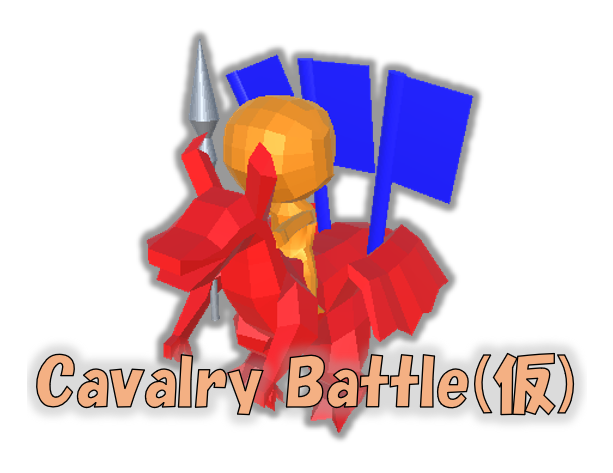

<h1 align="center">ゲームの概要</h1>

タイトルはCavalry-Battle(英語で騎馬戦)です。  
プラットフォームはスマートフォンを意識してます。  
開発人数は1人、制作期間は2ヶ月です。  
ファンタジー×騎馬戦がコンセプトの旗取り対戦ゲームです。  
戦略性を増すために、騎馬戦のルールに加えてHPを追加してます。  
プレイヤーをワクワクさせる要素としてドラゴンや技といったファンタジーな構成にしました。

## 苦労した点

特にオンライン化に苦労しました。  
オンラインに対応することを決めたとき、途中からオンライン機能を付けたすという考え方では躓くため、最初からオンライン化を意識して開発する必要があることを学びました。  
オンライン化にあたりPhoton Unity Networking2(PUN2)というUnityパッケージを使用していますが、ツールの特徴となる

- 自動で定期的にデータを送受信する機能(オブジェクト同期)
- RPC機能
- 部屋の共通変数を設定する機能(カスタムプロパティ)

の三つの機能を理解し、使い分けることで、HPの同期や、旗の位置や数の同期、制限時間の同期などを実現しました。

## ソースコードの場所

/Assets/Script/  

- クラス図([テキストファイル class-diagram.pu](https://github.com/socius1076/Cavalry-Battle-public/blob/master/UML/class-diagram.pu))  
このリポジトリに含まれているクラスを記載しています。  
他クラスと関係がある属性、操作を記載しています。  

- アピールポイントとなる対象のソースコード(処理の詳細はソースコードにコメントを記載しています)  

  オンライン化にあたりPhoton Unity Networking2(PUN2)というUnityパッケージを使用しています。  
  位置やアニメーションの同期はUnityエディタから設定しています。  

  - HPの同期
    1. [HPの同期 PlayerStatus.cs(138～152行)](https://github.com/socius1076/Cavalry-Battle-public/blob/master/Assets/Script/PlayerStatus.cs#L138)
    2. [ダメージ処理 Attack.cs(87～105行)](https://github.com/socius1076/Cavalry-Battle-public/blob/master/Assets/Script/Attack.cs#L87)
  - 旗の数の同期
    1. [旗を取ることに成功した場合 Attack.cs(134～161行)](https://github.com/socius1076/Cavalry-Battle-public/blob/master/Assets/Script/Attack.cs#L134)
    2. [旗の数を変更 FlagStatus.cs(65～147行)](https://github.com/socius1076/Cavalry-Battle-public/blob/master/Assets/Script/FlagStatus.cs#L65)
  - 旗の位置の同期  
    1. [旗を落とす指示 FlagStatus.cs(45～63行)](https://github.com/socius1076/Cavalry-Battle-public/blob/master/Assets/Script/FlagStatus.cs#L45)
    2. [旗を落とす処理 FlagDrop.cs(11～48行)](https://github.com/socius1076/Cavalry-Battle-public/blob/master/Assets/Script/FlagDrop.cs#L11)
  - 試合の流れの同期  
    1. [ルーム入室処理 Lobby.cs(48～54行)](https://github.com/socius1076/Cavalry-Battle-public/blob/master/Assets/Script/Lobby.cs#L48)
    2. [カメラが準備 MainCamera.cs(15～54行)](https://github.com/socius1076/Cavalry-Battle-public/blob/master/Assets/Script/MainCamera.cs#L15)
    3. [カスタムプロパティによる制御で使う関数 （Pun.cs 36行)](https://github.com/socius1076/Cavalry-Battle-public/blob/master/Assets/Script/Pun.cs#L36)
    4. [プレイヤーが集まったかどうか Pun.cs(123～177行)](https://github.com/socius1076/Cavalry-Battle-public/blob/master/Assets/Script/Pun.cs#L123)
    5. [部屋が作られてから経過した時間を同期 OnlineMenu.cs(46～66行)](https://github.com/socius1076/Cavalry-Battle-public/blob/master/Assets/Script/OnlineMenu.cs#L46)
    6. [カウントダウン、試合時間同期 OnlineMenu.cs(70～97行)](https://github.com/socius1076/Cavalry-Battle-public/blob/master/Assets/Script/OnlineMenu.cs#L70)
    7. [終了後の旗の数同期 OnlineMenu.cs(123～131行)](https://github.com/socius1076/Cavalry-Battle-public/blob/master/Assets/Script/OnlineMenu.cs#L123)
    8. [集計処理 Pun.cs(43～122行)](https://github.com/socius1076/Cavalry-Battle-public/blob/master/Assets/Script/Pun.cs#L43)
    9. [結果表示 OnlineMenu.cs(132～150行)](https://github.com/socius1076/Cavalry-Battle-public/blob/master/Assets/Script/OnlineMenu.cs#L132)
    - シーケンス図([テキストファイル sequence-diagram.pu](https://github.com/socius1076/Cavalry-Battle-public/blob/master/UML/sequence-diagram.pu))  

    

  - オブジェクト指向のメリットである継承を利用しております。([ObjectStatus.cs](https://github.com/socius1076/Cavalry-Battle-public/blob/master/Assets/Script/ObjectStatus.cs) [PlayerStatus.cs](https://github.com/socius1076/Cavalry-Battle-public/blob/master/Assets/Script/PlayerStatus.cs) [EnemyStatus.cs](https://github.com/socius1076/Cavalry-Battle-public/blob/master/Assets/Script/EnemyStatus.cs))
  - オブジェクト指向のメリットであるカプセル化を意識しております。(すべてのファイル)

- その他のアピールポイント

  - ゲーム内で使用されている3Dモデル、3DモデルのアニメーションはBlenderを使い制作しました。
  - Unityの機能を理解し、活用しております。
    - アニメーションの制御/Animator Controller
    - 敵の追尾処理/NavMesh
    - UI/Canvas,Panel,Button,Text...

## 機能紹介動画

/Movie/DemoMovie.mp4

## 対戦動画

/Movie/BattleMovie.mp4  
※音はありません。画面にノイズが走っておりますが、録画アプリによるものです。

## 動作環境

- PC  
OS : Windows
- スマートフォン  
OS : Android

※動作確認済み環境

- PC  
OS : Windows10 64bit
- スマートフォン  
OS : Android 8.0.0以降

## 起動方法

- PCの場合(Windows)  
/Game/PC フォルダ内の cavalry battle.exe から起動することができます。  

- スマートフォンの場合(Android)  
/Game/Smartphone フォルダ内の cavalry-battle-android.apk をスマートフォンにインストールすることで遊ぶことができます。  

手順は

1. apkファイルを端末のDownloadなどのフォルダにコピー
2. コピーしたapkファイルを端末で開く(タップ)する
3. 一時的に提供元不明のアプリを許可する

unityエディタを使用する場合、unityのバージョンは2019.2.18f1、AssetStoreより  
Joystick Pack, DOTween(HOTween v2), PUN2-FREE アセットが必要です。また、TextMesh Proのインポートが必要です。  
※PUN2-FREEのアプリケーションIDを公開していないため、Unityエディタ上でゲームを遊ぶことはできません。

## 基本操作

1. プレイヤー名を入力する
2. オンラインマッチングモードかトレーニングモードを選択する  
※オンラインマッチングモードは1vs1のオンライン対戦で、トレーニングモードは敵が一定間隔ごとに湧いてきます。  
3. 画面右ジョイステックで移動  
   ジャンプボタンでジャンプ  
   skillボタンでスキル(炎)発動、クールダウンあり  
   DoragonAttackボタンでドラゴンが攻撃  
   RiderAttackボタンでライダーが攻撃  
   RiderHuntボタンでライダーが旗をとる動作をする  
   画面の右半分をスワイプ(ドラッグ)してカメラを操作する

## ゲームのルール

現在1vs1に対応しています。
オンラインマッチングモードでは制限時間内で旗を取り合い、最後に旗を多く持っているプレイヤーの勝利です。  
旗の数が同じ場合、引き分けとなります。  
プレイヤーにはHPがあり、HPが0になると旗を落とし、一定時間行動不能状態になります。  
また、壁に当たるとダメージを受けます。  

トレーニングモードではプレイヤーは無敵で、ひたすら敵を倒すことや、旗を奪うことができます。  

どちらのモードも左上のボタンでロビー画面へ戻ることができます。

## 今後の実装予定

ゲームについて 3vs3対応,キャラクター追加,スピードアップ・スピードダウンスキル追加 等  
システムについて レンタルサーバとデータベースを利用した通信機能追加 等

## ライブラリや参考にしたプログラム

オンライン化にあたり、Photon Unity Networking2(PUN2)というUnityパッケージを使用してます。  
主に、書籍「作って学べるUnity本格入門」を参考にしました。

## 使用ソフト

- unity 2019.2.18f1  
- blender  
- krita  
- domino  
- audacity  
- sourcetree

## 権利表記

Script一部  
Copyright (c) 2020 Akihito Kako  
Released under the MIT license  
[https://github.com/akako/honkaku_unity/blob/master/LICENS](https://github.com/akako/honkaku_unity/blob/master/LICENSE)

## 製作者

socius1076

## 連絡先

felicitas1076@gmail.com
